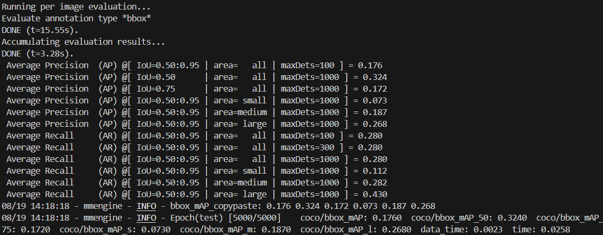

# Adversarial attacks for object detection

This repository covers some adversarial attacks for object detection, running using mmdetetection version 3.3.0.

Current attacks (to be updated):
* [Ensemble-based Blackbox Attacks on Dense Prediction](https://github.com/CSIPlab/EBAD) (EBAD)
* [Context-Aware Adversarial Attacks](https://github.com/CSIPlab/context-aware-attacks) (CAT)

## Run EBAD

### 1. Setup
In the root folder ```od_adversarial_attacks```, run:
```bash
conda env create -f environment.yml
conda activate od_attacks
pip install pre-commit
mim install mmdet==3.3.0
python mmdet_model_info.py
```

(Optional) Download COCO val2017 if you haven't:

```bash 
bash bash_scripts/get_coco_val2017.sh
```

(Optional) You can download additional pretrained detectors with different architectures by:
```bash
python mmdet_model_info.py --extra
```

### 2. Run EBAD attack on COCO val2017

In the root folder ```od_adversarial_attacks```, run:
```bash
python attacks/ebad.py --n_wb <surrogates_num> --victim <victim_name> --iters <iters_num> --iterw <iterw_num> ...
```

* Default example: 
```bash
python attacks/ebad.py --surrogates FasterR-CNN YOLOv3 --victim RetinaNet --iters 10 --iterw 10
```
* Note: If you encounter the deepcopy bug, you can go to the two_stage code and change the line from ```copy.deepcopy(batch_data_samples)``` to ```batch_data_samples.copy()```.

Important parser arguments:

```--surrogates```: Names of the surrogate detectors seperate by space.

```--victim```: Name of the victim detector.

```--iters```: Iner iterations update the perturbation with surrogate output and losses (default 10).

```--iterw```: Outer iterations update the perturbation with victim output (default 5).

```--eps```: $L_\infty$ constraint over 255 (default 10).

```--dataset```: The dataset of the images, COCO or VOC (default coco)

The perturbed images will be saved in the ```results`` directory.

### 3. Evaluation

After running attack, you can evaluate the mAP of the perturbed images.

In the root folder ```od_adversarial_attacks```, run:
```bash
bash bash_scripts/evaluation.sh -v <victim name> -s <perturbed images>
```
* Example:
```bash
bash bash_scripts/evaluation.sh -v YOLOv3 -s ~/od_adversarial_attacks/results/ebad/coco_victim_YOLOv3_nwb1_iters1_iterw1_linf10_alphax3_lr0.01_YOLOv3
```

The terminal should run something like:

